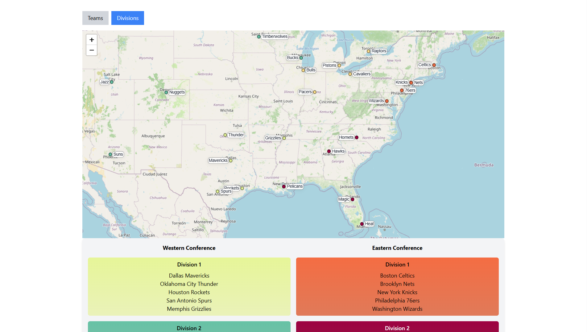

# Auto-Divisioner

Interactive web app that partitions sports teams into geographically balanced
divisions and conferences. Built as a playground for constrained clustering
algorithms with live visual feedback on an interactive map.

**Live demo:** https://kirillreuk.github.io/divisioner



## Problem

Given `N` teams with `(latitude, longitude)` coordinates, split them into `K`
divisions such that:

- Each division has at most `ceil(N / K)` teams (balanced size).
- Total intra-division travel distance is minimized.
- Optional "rivalry" groups must end up in the same division (treated as
  indivisible units).
- Two conferences are then formed by a longitudinal split of the final
  division centroids.

This is a constrained variant of balanced `k`-clustering, which is NP-hard in
the general case, so the solver is a heuristic pipeline rather than an exact
optimizer.

## Algorithm

The partitioner lives in [`src/utils/partitioning.ts`](src/utils/partitioning.ts)
and runs in four stages:

1. **Preprocessing.** Rivalry groups are collapsed into weighted pseudo-nodes
   so the clusterer treats them as single indivisible teams. Pairwise
   haversine distances are precomputed into an `O(N²)` matrix keyed by team
   id for `O(1)` lookups during optimization.
2. **Agglomerative merging.** Every team starts as its own singleton cluster.
   On each iteration the closest pair (by min-link distance) that respects
   the per-division size cap is merged. If no legal merge exists, the
   smallest cluster is dissolved and its members are reassigned to the
   nearest feasible clusters.
3. **Local-search refinement.** Once `K` clusters are reached, a
   time-budgeted hill climber (500 ms, up to 1000 iterations) explores a
   combined swap + move neighborhood, picking the best-improving step until
   a local optimum or the time budget is hit.
4. **Conference assignment.** Final divisions are sorted by centroid
   longitude and split in half to produce East/West conferences.

The clusterer has no React coupling — it's a plain TypeScript class that
can be tested in isolation.

## Architecture

- **Feature-first folder layout:**
  - [`src/app/`](src/app) — application shell, routing-like tab state,
    reducer wiring.
  - [`src/teams/`](src/teams) — team list, map picker, coordinate validation,
    custom hooks.
  - [`src/divisions/`](src/divisions) — generated division/conference views
    and Leaflet map.
  - [`src/components/`](src/components) — shared presentational components
    and modals.
  - [`src/utils/`](src/utils) — partitioner, distance math, color scales,
    geocoding client, shared types.
  - [`src/data/`](src/data) — constants and team presets (NBA, WNBA,
    Euroleague, …).
- **State via `useReducer`.**
  [`teamBuilderReducer.ts`](src/app/teamBuilderReducer.ts) defines a
  discriminated-union `TeamBuilderAction` type so all mutations are
  exhaustively typed. Any edit to teams, rivalries, or division count
  automatically invalidates the previously generated structure so the UI
  can't display stale results.
- **Custom hooks isolate side effects.**
  - [`useTeamActions`](src/teams/useTeamActions.ts) exposes the reusable
    `useAbortableLatest` helper: it returns a fresh `AbortSignal` on each
    call, aborting the previous one. Used to guarantee that only the latest
    geocoding request's response is applied to state, even under rapid user
    input.
  - [`useReverseGeocoding`](src/teams/useReverseGeocoding.ts) combines
    `lodash.debounce` with refs-for-latest-values to coalesce
    coordinate-edit bursts into a single reverse-lookup, flushing early
    when the user switches to a different team.
  - [`useTeamValidation`](src/teams/useTeamValidation.ts) centralizes
    latitude/longitude bounds checks so input components stay dumb.
- **Decoupled geocoding.** The OpenCage client lives in
  [`src/utils/geocoding.ts`](src/utils/geocoding.ts) and degrades
  gracefully when no API key is configured — the rest of the app stays
  fully functional.

## Testing

- Vitest + React Testing Library on a jsdom environment.
- Unit coverage for the partitioner, reducer, distance math, validation,
  and the async geocoding hooks (including abort-signal behavior).

```bash
npm run test          # watch
npm run test:run      # single pass
npm run test:coverage # V8 coverage report
```

## CI / Deployment

GitHub Actions builds the project and publishes it to GitHub Pages on push
to `main` — see
[`.github/workflows/deploy.yml`](.github/workflows/deploy.yml) and the
maintainer runbook in [`docs/deploy.md`](docs/deploy.md) for secrets,
Pages configuration, and troubleshooting.

## Tech stack

React 18 · TypeScript (strict) · Vite · Tailwind CSS · React-Leaflet +
OpenStreetMap · Headless UI · chroma-js (Spectral palette for division
colors) · lodash.debounce · OpenCage Geocoding.

## Quick start

```bash
npm install
npm run dev
```

Optional — enable geocoding locally by creating `.env.local`:

```bash
VITE_OPENCAGE_API_KEY=your_opencage_api_key
```

Without this variable the app still runs; only location search and reverse
geocoding are disabled.

## Possible next steps

- Move the partitioner into a Web Worker so long-running optimizations
  don't block the main thread on large inputs.
- Compare the current greedy + local-search heuristic against simulated
  annealing or a small ILP formulation on benchmark inputs.
- Persist team lists and rivalries to `localStorage` / a shareable URL.
- Add an "import CSV" flow next to the built-in presets.

## License

MIT — made by Kirill Reuk.
